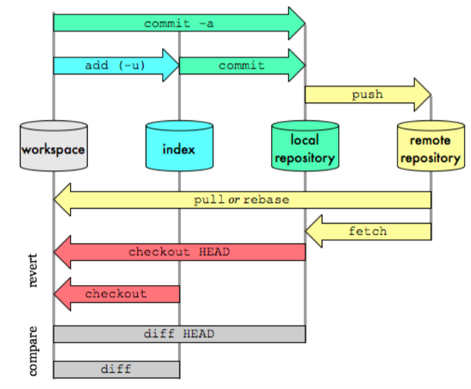

# Git

[Git Reference](https://git-scm.com/docs)

`git help`, `man git`, `git <command> --help` 명령어를 통해 각 명령어의 사용법을 확인할 수 있다.

## Git Command Workflow

## Git Branch Model
- [{Git,Github,Gitlab} Flow 1](https://ujuc.github.io/2015/12/16/git-flow-github-flow-gitlab-flow/)
- [{Git,Github,Gitlab} Flow 2](https://wiki.yowu.dev/ko/dev/Git/about-git-github-gitlab-flow)
- [Trunk Based Development](https://trunkbaseddevelopment.com)
- [Trunk Based Development 기술 블로그](https://tech.mfort.co.kr/blog/2022-08-05-trunk-based-development/)

## Git Command

### restore
- `git restore <modified file>` : 파일을 수정하기 전 상태로 되돌린다.
- `git restore --staged <file>` : 스테이징된 파일을 언스테이징한다.
- `git restore --source=<hash> <file>` : 특정 커밋의 파일을 수정하기 전 상태로 되돌린다.

### fetch
- `git fetch` : 원격 저장소의 변경사항을 로컬 저장소로 가져온다.

# Github

## Github Pages
