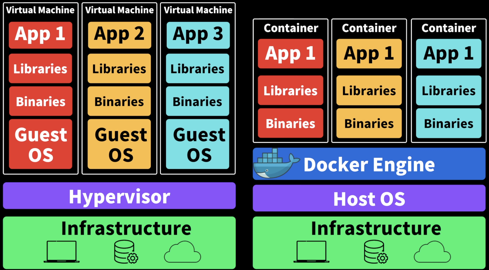

# Docker

## What is Docker?
`Docker`란 `Application`을 `Container`로 패키징하여 어느 환경에서든 배포할 수 있도록 하는 플랫폼이다.

- [Docker docs](https://docs.docker.com/guides/)
- [Docker란? - Red Hat](https://www.redhat.com/ko/topics/containers/what-is-docker)
- [Docker - 드림코딩](https://www.youtube.com/watch?v=LXJhA3VWXFA)
- [생활코딩 Docker](https://www.youtube.com/playlist?list=PLuHgQVnccGMDeMJsGq2O-55Ymtx0IdKWf)

### What is Container?
One small, Standardised `unit of software`

다음과 같은 구성요소를 포함한다.
- Application
- System Tools
- Dependencies

[리눅스 컨테이너란? - Red Hat](https://www.redhat.com/ko/topics/containers/whats-a-linux-container)

#### The Benefits of Container
1. **어떤 PC에서든 어떤 환경에서든 동일하게 실행**된다.
2. `내 PC에서는 잘 되는데, 너의 PC에서는 왜 안되는 거지?`라는 문제를 해결할 수 있다.
3. 여러 설치 과정을 거치지 않아도 된다.

node.js Application을 개발할 때를 예로 들어보자.
소스 코드만 서버에 배포하는 것만으로는 구동하는 데 여러 문제가 있다.
- node.js 버전 호환성 문제
- npm, 여러 라이브러리들을 사용한다면 여러 Dependency들을 설치해야 한다.
- 환경 설정, 환경 변수 설정 등을 해야 한다.

이러한 문제들을 해결하기 위해 Container를 사용한다.
Docker Container는 `Application을 실행하는 데 필요한 모든 것을 포함`한다.
- node.js
- npm
- Application
- Config
- Dependencies
- 소스 코드

<details>
<summary>Container vs VM</summary>

```
VM과 Container의 주요 차이는 VM은 각각 독립된 커널을 가지지만, Container는 호스트의 커널을 공유한다는 점입니다.
윈도우에서 Docker Container를 사용한다면, 이전 버전의 Docker는 가상화된 리눅스 커널을 사용했으나, 최신 버전에서는 WSL 2(Windows Subsystem for Linux 2)를 통해 윈도우 상에서 직접 리눅스 커널을 실행할 수 있게 되었습니다. 
이는 윈도우에서 별도의 리눅스 커널을 "만드는" 것이 아니라, 효율적으로 호스트 시스템의 리소스를 활용하는 방식입니다.

단일 VM이나 단일 Container를 가동할 때의 속도 차이는 그 차이가 크지 않을 수 있습니다.
그러나, 여러 개의 인스턴스를 실행할 때 컨테이너의 효율성이 두드러집니다.
VM은 각각 독립된 커널을 가지며 전체 게스트 운영체제를 실행하기 때문에 더 많은 리소스를 요구하지만, 컨테이너는 모든 컨테이너가 하나의 호스트 커널을 공유하기 때문에 리소스 사용이 더 효율적입니다.

결론적으로, 여러 개의 인스턴스를 실행할 때 VM은 각각 독립된 커널과 운영체제 환경을 가지는 반면, 컨테이너는 하나의 호스트 커널을 공유하여 리소스를 더 효율적으로 사용할 수 있습니다.
```

만약 운영체제가 **linux**라면 그 위에서 바로 도커 컨테이너를 실행할 수 있기 때문에 성능 저하가 없지만, **macOS**나 **Windows**에서는 가상 머신 위에서 도커 컨테이너를 실행하기 때문에 성능 저하가 있다. 그럼에도 불구하고 도커 컨테이너를 사용하는 이유는 `편의성` 때문이다.

> 컨테이너 기술 자체는 도커(Docker)에만 한정된 것이 아니며, 리눅스(Linux) 시스템의 기본적인 기능과 기술을 바탕으로 합니다. 리눅스 컨테이너는 리눅스의 핵심 기능인 cgroups(Control Groups)와 네임스페이스(namespaces)를 사용하여 프로세스의 격리를 달성합니다. 이러한 기술을 통해 각 컨테이너는 독립된 환경을 가지면서도, 동일한 리눅스 커널을 공유할 수 있습니다.
> 
> cgroups(Control Groups): 리소스 사용량(메모리, CPU, 네트워크 대역폭 등)을 제한하고, 우선 순위를 지정하며, 리소스 사용을 모니터링하고 관리하는 기능을 제공합니다. 이를 통해 컨테이너마다 할당된 리소스를 제어할 수 있습니다.
> 
> 네임스페이스(namespaces): 프로세스, 네트워크 인터페이스, 마운트 포인트, 사용자 ID 등을 분리하여 각 컨테이너가 독립적인 환경을 가질 수 있게 합니다. 이를 통해 하나의 시스템에서 여러 컨테이너를 실행할 때 각각이 서로 영향을 주지 않고 독립적으로 작동할 수 있습니다.
> 
> 도커는 이러한 리눅스의 기존 기술을 기반으로 하여, 컨테이너를 보다 쉽게 생성, 배포, 실행할 수 있는 고수준의 인터페이스와 툴을 제공합니다. 따라서 컨테이너 기술은 리눅스에 종속된 기술이며, 도커는 이를 활용하여 개발 및 운영의 편의성을 개선한 솔루션입니다. 물론, 컨테이너 기술은 리눅스 외에도 Windows Container와 같은 다른 플랫폼에서도 구현되고 있습니다.
</details>

#### Virtual Machine vs Container
결론: 둘 다 Application을 실행하는 데 필요한 모든 것을 캡슐화한다.
- VM은 운영체제를 포함하기 때문에 무겁고 느리다.(컴퓨터 전체를 캡슐화)
- Container는 Host OS에서 Container Engine을 통해 Application을 실행하기 때문에 가볍고 빠르다.(Application에 필요한 것만 캡슐화)

[컨테이너와 VM 비교 - AWS](https://aws.amazon.com/ko/compare/the-difference-between-containers-and-virtual-machines/)\
[Containers vs Virtual Machines | Atlassian](https://www.atlassian.com/microservices/cloud-computing/containers-vs-vms)\
[Containers vs. virtual machines (VMs) | Google Cloud](https://cloud.google.com/discover/containers-vs-vms#:~:text=Virtual%20machines%20provide%20an%20abstracted,a%20physical%20or%20virtual%20machine.)

##### Structure of Virtual Machine

Infrastructure(Hardware)

`한 운영체제 위에 동일한 Application`을 각각의 `고립된 다른 환경에서 실행`하기 위해 필요했다.\
하지만 무거운 운영체제를 포함하기 때문에 무겁고 시작하는 데 오래 걸리고 컴퓨터, 운영체제 등의 자원을 많이 사용하기 때문에 느리다.

##### Structure of Container

`Host OS` 위에서 `Container Engine`이라는 소프트웨어를 통해 `각각의 Application을 고립된 환경에서 실행`시킬 수 있다.\
Container가 구동되기 위해서는 Container Engine이 필요하고, Container Engine은 Host OS에 접근하여 필요한 자원을 사용한다.\
Container Engine 중 하나가 `Docker`이다.

### Building Containers
1. Dockerfile 작성
2. Docker Image 빌드
3. Container 실행

#### Dockerfile
`Image`를 만들기 위한 설명서, 스크립트 파일
1. Base Image: 기본이 되는 이미지
2. Copy files: Application을 만들기 위한 파일들을 복사
3. Install dependencies: 필요한 라이브러리, 프로그램 설치
4. Set environment variables: 환경 변수 설정
5. Run setup scripts: 설정 스크립트 실행

```Dockerfile
# Base Image
FROM node:14

# Working Directory
WORKDIR /usr/src/app

# Copy files
COPY package*.json ./

# Install dependencies
RUN npm install

# Copy source code
COPY . .

# Set environment variables
ENV PORT=3000

# Expose port
EXPOSE 3000

# Run setup scripts
CMD ["node", "app.js"]
```

`docker build` 명령어를 사용하여 Docker Image를 빌드할 수 있다.
```bash
docker build -t my-node-app .
```

#### Docker Image
- Application을 실행하기 위한 코드, 라이브러리, 환경 변수, 설정 등을 포함하는 파일
- `실행되고 있는 Application의 상태를 스냅샷으로 저장한 것`
- 만들어진 Docker Image는 변경이 불가능하다.

#### Container
- Docker Image를 고립된 환경에서 실행할 수 있도록 하는 것
- `Docker Image`와 `Container`는 객체지향 프로그래밍에서 `Class`와 `Instance`와 비슷한 관계라고 볼 수 있다.
- Docker Image의 틀을 가지고 실행된 각각의 Container는 독립적으로 실행되며, Container의 수정은 다른 Container와 Docker Image에 영향을 주지 않는다.

`docker run` 명령어를 사용하여 Docker Image를 실행할 수 있다.
```bash
docker run -p 3000:3000 my-node-app
```

### Shipping Containers (Deploying Containers)
개인 PC에서 깃허브같은 Remote Repository에 소스 코드를 push하고 다른 PC에서 pull 받아서 실행하는 것과 같은 방식으로 Docker Image를 만들어 Docker Hub같은 Container Registry에 push하고 다른 PC에서 pull 받아서 실행할 수 있다.

- public의 경우 `docker hub`, `redhat quay`, `github packages` 등을 사용
- private의 경우 `AWS`, `Google Cloud`, `Azure` 등을 사용

## Docker Compose
- **다중 컨테이너 도커 애플리케이션 관리**: 도커 컴포즈는 하나의 애플리케이션에서 여러 컨테이너가 협력하여 작동할 때 이들을 쉽게 관리할 수 있게 해준다.
- **YAML 파일 기반 구성**: 서비스(컨테이너), 네트워크, 볼륨 등을 포함하는 애플리케이션의 전체 구조를 YAML 파일 하나로 정의할 수 있다.
- **개발, 테스트, 생산 환경에서의 일관된 환경 제공**: 도커 컴포즈를 사용하면 코드와 함께 설정을 저장하고 공유할 수 있어, 개발부터 운영까지 일관된 환경을 유지할 수 있다.
- **간편한 배포**: `docker-compose up` 명령어 한 줄로 모든 서비스를 시작하고, `docker-compose down` 명령어로 종료할 수 있다.

### Create a docker-compose.yml file
애플리케이션의 서비스, 네트워크, 볼륨 등을 정의
```yaml
version: '3'
services:
  web:
    image: nginx:latest
    ports:
      - "8080:80"
  db:
    image: mysql:5.7
    environment:
      MYSQL_ROOT_PASSWORD: password
```

### Start the application
`docker-compose up` 명령어를 사용하여 `docker-compose.yml` 파일에 정의된 모든 서비스를 시작
```bash
docker-compose up
```

### Manage the application
`docker-compose` 명령어를 사용하여 서비스를 시작, 정지, 재시작, 로그 확인 등을 할 수 있다.

### Clean up the environment
`docker-compose down` 명령어를 사용하여 시작된 모든 서비스를 종료하고 네트워크, 볼륨 등을 정리
