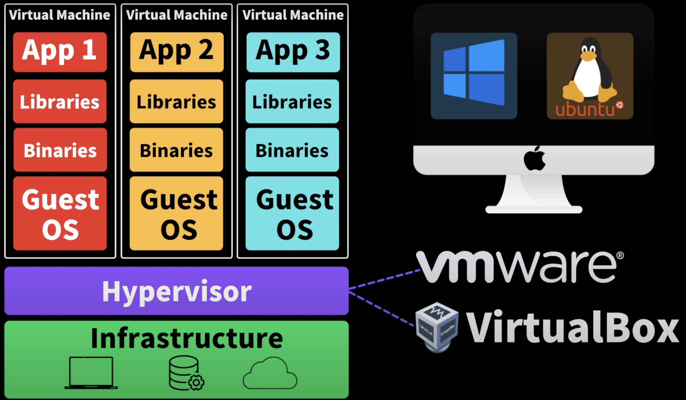

# Docker

## What is `Docker`?
Docker란 Application을 Container로 패키징하여 어느 환경에서든 배포할 수 있도록 하는 플랫폼이다.

- [Docker - 드림코딩](https://www.youtube.com/watch?v=LXJhA3VWXFA)

### What is `Container`?
하나의 작은 소프트웨어 유닛
- Application
- System Tools
- Dependencies

#### The Benefits of Container
1. 어떤 PC에서든 어떤 환경에서든 동일하게 실행된다.
2. `내 PC에서는 잘 되는데, 너의 PC에서는 왜 안되는 거지?`라는 문제를 해결할 수 있다.
3. 여러 설치 과정을 거치지 않아도 된다.

node.js Application을 개발할 때를 예로 들어보자.
소스 코드만 서버에 배포하는 것만으로는 구동하는 데 여러 문제가 있다.
- node.js 버전 호환성 문제
- npm, 여러 라이브러리들을 사용한다면 여러 Dependency들을 설치해야 한다.
- 환경 설정, 환경 변수 설정 등을 해야 한다.

이러한 문제들을 해결하기 위해 Container를 사용한다.
Docker Container는 `Application을 실행하는 데 필요한 모든 것을 포함`한다.
- node.js
- npm
- Application
- Config
- Dependencies
- 소스 코드

#### Virtual Machine vs Container
> 결론: VM은 운영체제를 포함하기 때문에 무겁고 느리다.\
> 반면, Container는 Host OS에서 Container Engine을 통해 Application을 실행하기 때문에 가볍고 빠르다.

- [컨테이너와 VM 비교 - AWS](https://aws.amazon.com/ko/compare/the-difference-between-containers-and-virtual-machines/)
- [Containers vs Virtual Machines | Atlassian](https://www.atlassian.com/microservices/cloud-computing/containers-vs-vms)
- [Containers vs. virtual machines (VMs) | Google Cloud](https://cloud.google.com/discover/containers-vs-vms#:~:text=Virtual%20machines%20provide%20an%20abstracted,a%20physical%20or%20virtual%20machine.)

##### Structure of Virtual Machine

Infrastructure(Hardware)

한 운영체제 위에 동일한 Application을 각각의 고립된 다른 환경에서 실행하기 위해 필요했다.\
하지만 무거운 운영체제를 포함하기 때문에 무겁고 시작하는 데 오래 걸리고 컴퓨터, 운영체제 등의 자원을 많이 사용하기 때문에 느리다.

##### Structure of Container

Host OS 위에서 Container Engine이라는 소프트웨어를 통해 각각의 Application을 고립된 환경에서 실행시킬 수 있다.

Container가 구동되기 위해서는 Container Engine이 필요하고, Container Engine은 Host OS에 접근하여 필요한 자원을 사용한다.

Container Engine 중 하나가 `Docker`이다.

### Building Containers
1. Dockerfile 작성
2. Docker Image 빌드
3. Container 실행

#### Dockerfile
Container를 만들기 위한 설명서
- Copy files: Application을 만들기 위한 파일들을 복사
- Install dependencies: 필요한 라이브러리, 프로그램 설치
- Set environment variables: 환경 변수 설정
- Run setup scripts: 설정 스크립트 실행

#### Docker Image
- Application을 실행하기 위한 코드, 라이브러리, 환경 변수, 설정 등을 포함하는 파일
- `실행되고 있는 Application의 상태를 스냅샷으로 저장한 것`
- 만들어진 Docker Image는 변경이 불가능하다.

#### Container
- Docker Image를 고립된 환경에서 실행할 수 있도록 하는 것
- Docker Image와 Container는 객제지향 프로그래밍에서 Class와 Instance와 비슷한 관계라고 볼 수 있다.
- Docker Image의 틀을 가지고 실행된 각각의 Container는 독립적으로 실행되며, Container의 수정은 다른 Container와 Docker Image에 영향을 주지 않는다.

### Shipping Containers (Deploying Containers)
개인 PC에서 깃허브같은 Remote Repository에 소스 코드를 push하고 다른 PC에서 pull 받아서 실행하는 것과 같은 방식으로 Docker Image를 만들어 Docker Hub같은 Container Registry에 push하고 다른 PC에서 pull 받아서 실행할 수 있다.

- public의 경우 `docker hub`, `redhat quay`, `github packages` 등을 사용
- private의 경우 `AWS`, `Google Cloud`, `Azure` 등을 사용
